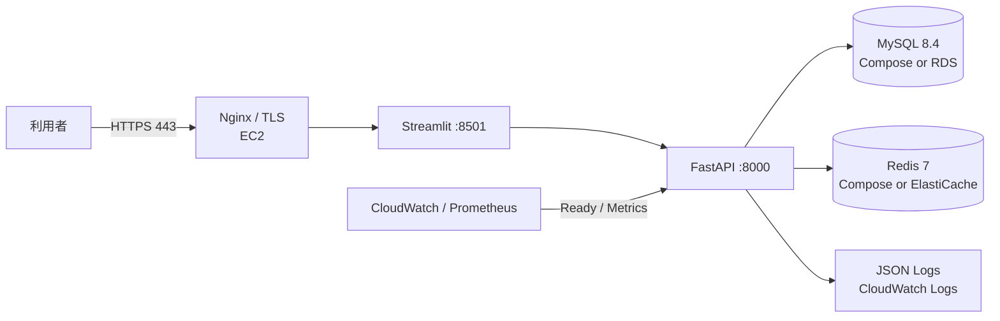

# AWS EC2 デプロイガイド

本書は、Amazon EC2 上で Docker Compose を使って本システムを起動するための基準手順です。単一 EC2 上で MySQL と Redis も稼働させる構成は、小規模環境や検証用途のベースラインです。業務運用では MySQL を Amazon RDS、Redis を Amazon ElastiCache に分離し、バックアップ、可用性、パッチ適用をマネージドサービスへ寄せる構成を推奨します。

## 構成



## 事前準備

- EC2: Ubuntu Server 24.04 LTS、`t3.small` 以上を目安に選択します。
- Storage: EBS を暗号化し、MySQL を同居させる場合はデータ容量と snapshot 方針を事前に決めます。
- Domain/TLS: Route 53 等の DNS と TLS 証明書を準備します。
- Secrets: `.env` に設定する長いランダムな `SECRET_KEY` と DB password を用意します。本番では AWS Systems Manager Parameter Store または Secrets Manager を利用する運用を推奨します。

## Security Group

インターネットから許可する inbound は次に限定します。

| Port | Source | 用途 |
|---|---|---|
| `22` | 管理用固定 IP のみ | SSH |
| `80` | `0.0.0.0/0`, `::/0` | Let's Encrypt / HTTPS redirect |
| `443` | `0.0.0.0/0`, `::/0` | Application HTTPS |

`3306`、`6379`、`8000`、`8501` をインターネット向けに許可しないでください。`docker-compose.yml` はローカル確認のため各 port を host に publish するため、外部到達性は Security Group で確実に制限します。Docker 公式資料では published port が `ufw` / `firewalld` のルールを迂回し得ると説明されているため、host 側でも追加制限する場合は Docker が管理する firewall chain を考慮して設計してください。RDS / ElastiCache を利用する場合は、EC2 security group からのみ DB / Redis security group へ接続を許可します。

## EC2 セットアップ

SSH 接続後、Docker Engine と Compose plugin を導入します。Docker の公式 Ubuntu インストール手順を使用し、導入後に以下を確認してください。

```bash
docker --version
docker compose version
git --version
```

アプリケーションを配置します。

```bash
sudo mkdir -p /opt/conference-room
sudo chown "$USER":"$USER" /opt/conference-room
git clone https://github.com/Ren-Tianming/conference-room-reservation-system.git /opt/conference-room/app
cd /opt/conference-room/app
cp .env.example .env
```

## 本番環境変数

`.env` の値を本番用に変更します。最低限、次を設定してください。

```dotenv
ENV=production
DEBUG=false
LOG_LEVEL=INFO
AUTO_CREATE_TABLES=false

SECRET_KEY=<32文字以上のランダム値>
JWT_ISSUER=conference-room-api
JWT_AUDIENCE=conference-room-users
REFRESH_TOKEN_CLEANUP_INTERVAL_SECONDS=3600
MAX_BOOKING_DURATION_HOURS=8

MYSQL_DATABASE=conference_room
MYSQL_USER=conference_user
MYSQL_PASSWORD=<ランダムなDBパスワード>
MYSQL_ROOT_PASSWORD=<ランダムなrootパスワード>

CORS_ORIGINS=https://app.example.com
REQUIRE_REDIS_FOR_LOCKS=true
REQUIRE_REDIS_FOR_TOKEN_BLACKLIST=true
```

最初の管理者を作る場合のみ、初回起動に次の値を設定します。管理者作成確認後は `.env` から削除し、コンテナを再起動してください。

```dotenv
BOOTSTRAP_ADMIN_USERNAME=admin
BOOTSTRAP_ADMIN_PASSWORD=<一時的な強いパスワード>
```

## 起動と Migration

イメージを build し、migration とサービス起動を実行します。backend image の起動 command は `alembic upgrade head` の成功後に FastAPI を開始します。

```bash
cd /opt/conference-room/app
docker compose build
docker compose up -d
docker compose ps
```

起動確認:

```bash
curl -fsS http://127.0.0.1:8000/api/v1/health
curl -fsS http://127.0.0.1:8000/api/v1/ready
```

`/api/v1/ready` が `503` の場合は、トラフィックを流す前に MySQL と Redis の接続、環境変数、migration ログを確認します。

## Nginx と TLS

外部から backend や Streamlit の port に直接接続させず、Nginx で TLS を終端します。一例として、UI 用の `app.example.com` を Streamlit (`127.0.0.1:8501`) に、API 用の `api.example.com` を FastAPI (`127.0.0.1:8000`) に proxy します。

```nginx
server {
    listen 443 ssl;
    server_name app.example.com;

    location / {
        proxy_pass http://127.0.0.1:8501;
        proxy_http_version 1.1;
        proxy_set_header Upgrade $http_upgrade;
        proxy_set_header Connection "upgrade";
        proxy_set_header Host $host;
    }
}

server {
    listen 443 ssl;
    server_name api.example.com;

    location / {
        proxy_pass http://127.0.0.1:8000;
        proxy_set_header Host $host;
        proxy_set_header X-Real-IP $remote_addr;
        proxy_set_header X-Request-ID $request_id;
    }

    location = /api/v1/metrics {
        deny all;
    }
}
```

監視サーバーから metrics を収集する場合は、`/api/v1/metrics` の許可元を監視ネットワークに限定してください。Nginx と証明書の導入後、`CORS_ORIGINS` を実際の frontend HTTPS domain に合わせます。Compose 構成の Streamlit は server-side で `http://backend:8000/api/v1` に接続するため、内部 URL のままで構いません。

## 監視とログ

バックエンドは JSON 形式で標準出力へログを書き出し、各応答に `X-Request-ID` を付与します。HTTP ログには `method`、`path`、`status_code`、`duration_ms` が含まれ、以下の操作は監査イベントとして検索できます。

- `login_failed` / `login_rate_limited`
- `booking_created` / `booking_cancelled`
- `admin_room_created`
- `bootstrap_admin_created`

CloudWatch Agent または Docker logging driver でコンテナ標準出力を CloudWatch Logs に転送し、`request_id` で API 障害と操作イベントを関連付けます。

監視対象 endpoint:

| Endpoint | 用途 | Alert 例 |
|---|---|---|
| `/api/v1/health` | process liveness | 連続失敗で container / host 異常 |
| `/api/v1/ready` | DB / 必須 Redis readiness | `503` で即時通知または切り離し |
| `/api/v1/metrics` | HTTP count / duration | `5xx` 増加、処理時間上昇 |

現在の `/metrics` は単一 backend process 内の in-memory 指標です。複数 replica 化する際は Prometheus collector の構成または OpenTelemetry / CloudWatch Embedded Metric Format への移行を設計してください。

## 更新手順

deploy 前に CI が成功している commit を選択し、EC2 上で取得して再 build します。

```bash
cd /opt/conference-room/app
git pull --ff-only origin main
docker compose build
docker compose up -d
docker compose ps
curl -fsS http://127.0.0.1:8000/api/v1/ready
```

schema migration が含まれるリリースでは、事前に MySQL backup を取得してください。破壊的 migration は自動 downgrade に頼らず、復旧計画を用意してから実行します。

## Backup と復旧

- EC2 内 MySQL: EBS snapshot に加えて `mysqldump` の定期保管を設定します。
- RDS: automated backups と point-in-time recovery を有効化します。
- Redis: token blacklist と短期 cache の用途を踏まえ、障害時の fail-closed 挙動を優先します。
- `.env`: repository や AMI に埋め込まず、Secrets Manager / Parameter Store から復元できるようにします。

## 停止

```bash
cd /opt/conference-room/app
docker compose down
```

MySQL volume を削除する `docker compose down -v` はデータ破棄を伴うため、本番環境では実行しないでください。

## 参考資料

- [Docker Engine: Install on Ubuntu](https://docs.docker.com/engine/install/ubuntu/)
- [Docker Compose plugin installation](https://docs.docker.com/compose/install/linux/)
- [Amazon EC2 security group rules](https://docs.aws.amazon.com/AWSEC2/latest/UserGuide/security-group-rules.html)
- [Installing the CloudWatch agent on EC2](https://docs.aws.amazon.com/AmazonCloudWatch/latest/monitoring/install-CloudWatch-Agent-on-EC2-Instance.html)
- [Amazon RDS automated backups and point-in-time recovery](https://docs.aws.amazon.com/AmazonRDS/latest/UserGuide/USER_WorkingWithAutomatedBackups.html)
